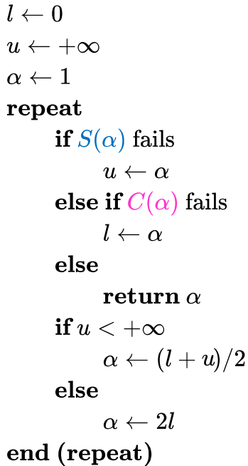
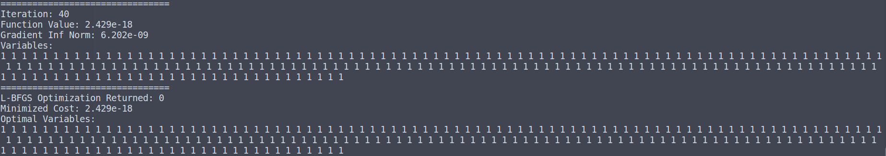
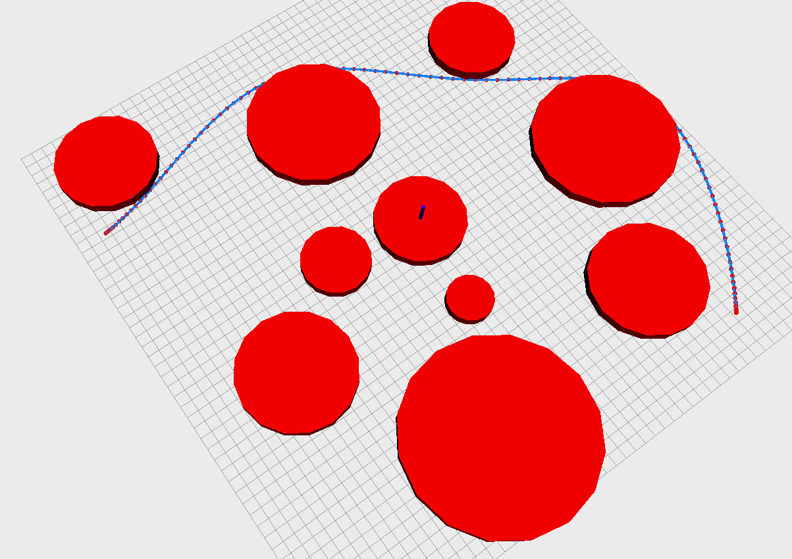
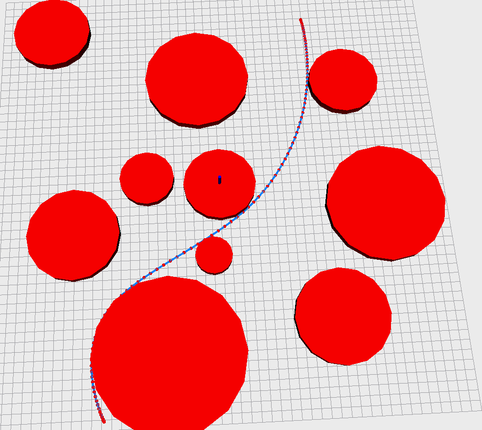
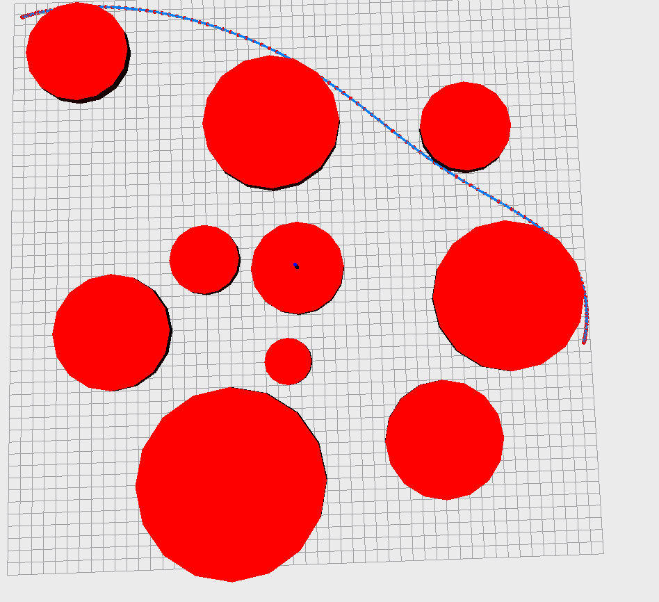

## Project 2: Smooth Navigation Path Generation

From: https://github.com/ChenJiahao031008/Numerical_Optimization

### 1 Workflow

1. Cubic Spline:
   $$
   \begin{aligned}
   \rho(s) &= a_i + b_is_i + c_is_i^2 + d_is_i^3,\ s_i\in(0,1)\\
   \rho(s)^{'} &=b_i + 2c_is_i + 3d_is_i^2,\\
   \rho(s)^{''} &=2c_i + 6d_is_i
   \end{aligned}
   $$
   and  natural spline is: $\rho(s_0)^{''} = \rho(s_N)^{''} = 0$. Ref: [Zhihu](https://zhuanlan.zhihu.com/p/62860859)

2. CostFunction: 
   $$
   \begin{aligned}
   \text{cost}&=\text{Energy}(x_1,...,x_{N-1}) + \text{Potential}(x_1,...,x_{N-1})  \\
   	&= \sum_{i=0}^{N}(4c_i^2 + 12c_id_i + 12d_i^2)\ 
   	+\ 1000\sum_{i=1}^{N-1}\sum_{j=1}^{M}\left(\max(r_j - \|x_i - o_i\|,0)\right)  \\
   	\text{where},&\\
   	x_i & = [\bar x_i, \bar y_i]_{1\times2}\\
   	a_i &= x_i\\
   	b_i &= D_i\\
   	c_i &=-3(x_i - x_{i+1}) -2D_i - D_{i+1}\\
   	d_i &= 2(x_i - x_{i+1}) + D_i + D_{i+1}\\
   	\text{and,  here:}&\\
   	&\begin{bmatrix} D_1\\ D_2\\ ...\\D_{N-1} \end{bmatrix}_{(N-1)\times 2}
   	= 	\begin{bmatrix}
   		4 &1 \\ 1 & 4 & 1 \\& ...& ...& ...\\& &1 &4 &1 \\ &&&1 &4
   		\end{bmatrix}^{-1}_{(N-1)\times(N-1)}
   	\begin{bmatrix} 3(x_2-x_0)\\  3(x_2-x_0)\\ ...\\3(x_N-x_{N-2}) \end{bmatrix}_{(N-1)\times 2}
   \end{aligned}
   $$

   + **About Band Matrix**: lower and upper bandwidth are both 1. Ref: [Zhihu](https://zhuanlan.zhihu.com/p/400460201)

   + **Discussion: Why do we use cubic spline interpolation for two dimensions?**

     Although track optimization is time-independent, coordinates are an expression of time t in subsequent work.  Therefore, two-dimensional optimization is employed for convenience.

   + **Core Code**:

     ```c++
     inline void setInnerPoints(const Eigen::Ref<const Eigen::Matrix2Xd> &inPs)
     {
         A.reset();
         b.setZero();
         for (int i = 0; i < N - 1; ++i)
         {
             if (i == 0){
                 A(0, 0) = 4; A(0, 1) = 1;
             }else if (i == N - 2){
                 A(N - 2, N - 3) = 1; A(N - 2, N - 2) = 4;
             }else{
                 A(i, i - 1) = 1; A(i, i) = 4; A(i, i + 1) = 1;
             }
         }
     
         b.row(0) = 3 * (inPs.col(1).transpose() - headP.transpose());
         for (int i = 1; i < N - 2; ++i){
             b.row(i) = 3 * (inPs.col(i + 1).transpose() - inPs.col(i - 1).transpose());
         }
         b.row(N - 2) = 3 * (tailP.transpose() - inPs.col(N - 3).transpose());
     
         A.factorizeLU();
         A.solve(b);
         
         ......
     
         // 将b重新塑性为系数矩阵
         b.resize(4 * N, 2);
         b = coeff.transpose();
     }
     
     inline void getStretchEnergy(double &energy) const
     {
         // An example for you to finish the other function
         energy = 0.0;
         for (int i = 0; i < N; ++i)
         {
             energy += 4.0 * b.row(4 * i + 2).squaredNorm() +
                 12.0 * b.row(4 * i + 2).dot(b.row(4 * i + 3)) +
                 12.0 * b.row(4 * i + 3).squaredNorm();
         }
     }
     ```

3. Gradient:

   + Energy Gradient

     + **Formula**:
       $$
       \begin{aligned}
       \frac{\partial E}{\partial x}|_{x_1,..,x_{N-1}}&= 
       	\sum_{i=0}^{N-1}[
       	(8c_i + 12d_i)\frac{\partial c_i}{\partial x} 
       	+ (12c_i + 24d_i)\frac{\partial d_i}{\partial x} ]\\
       	
       	\text{where},&\\
       	\frac{\partial c_i}{\partial x}|_{x_1,..,x_{N-1}}&=
       	-3\frac{\partial (x_i - x_{i+1})}{\partial x} 
       	-2\frac{\partial D_i}{\partial x} - \frac{\partial D_{i+1}}{\partial x}\\
       	
       	\frac{\partial d_i}{\partial x}|_{x_1,..,x_{N-1}}&=
       	2\frac{\partial (x_i - x_{i+1})}{\partial x} 
       	+\frac{\partial D_i}{\partial x} + \frac{\partial D_{i+1}}{\partial x}\\
       
       	\frac{\partial}{\partial x}\begin{bmatrix} x_0 - x_1\\
           x_1 -x_2 \\...\\ x_N - x_{N-1}\end{bmatrix}&=
           \begin{bmatrix}
       		-1 \\ 1 & -1 \\& ...& ...\\& &1 &-1 \\ &&&1 &-1
       		\end{bmatrix}_{(N-1)\times(N-1)}
       		
       	\end{aligned}
       		\\
       		\frac{\partial D_i}{\partial x}
       		= 	\begin{bmatrix}
       		4 &1 \\ 1 & 4 & 1 \\& ...& ...& ...\\& &1 &4 &1 \\ &&&1 &4
       		\end{bmatrix}^{-1}_{(N-1)\times(N-1)}
       		\begin{bmatrix}
       		0 &3 \\ -3 & 0 & 3 \\& ...& ...& ...\\& &-3 &0 &3 \\ &&&-3 &0
       		\end{bmatrix}_{(N-1)\times(N-1)}
       $$

     + **Core Code**:

       ```c++
       inline void getGrad(Eigen::Ref<Eigen::Matrix2Xd> gradByPoints) const
       {
           // * step1：获取 \partial_x(D), x is [x_1, ... , x_n-1]
           ......
       
           // * step2：获取 \partial_x(x_i - x_{i+1}), x is [x_1, ... , x_n-1]
        	......
       
           // * step3: 获取\partial_x(c)和\partial_x(d), x is [x_1, ... , x_n-1]
           Eigen::MatrixXd partial_c; partial_c.resize(N, N - 1);
           partial_c.setZero();
           Eigen::MatrixXd partial_d; partial_d.resize(N, N - 1);
           partial_d.setZero();
       
           partial_c.row(0) = -3 * partial_diff_x.row(0) - partial_D.row(0);
           partial_d.row(0) = 2 * partial_diff_x.row(0) + partial_D.row(0);
           for (size_t i = 1; i < N - 1; ++i)
           {
               partial_c.row(i) = -3 * partial_diff_x.row(i) - 2 * partial_D.row(i - 1) - partial_D.row(i);
               partial_d.row(i) = 2 * partial_diff_x.row(i) + partial_D.row(i - 1) + partial_D.row(i);
           }
           partial_c.row(N - 1) = -3 * partial_diff_x.row(N - 1) - 2 * partial_D.row(N - 2);
           partial_d.row(N - 1) = 2 * partial_diff_x.row(N - 1) + partial_D.row(N - 2);
       
       
           // * step4: 填入gradByPoints
           gradByPoints.setZero();
           for (size_t i = 0; i < N; ++i)
           {
               Eigen::Vector2d c_i = coeff.col(4 * i + 2);
               Eigen::Vector2d d_i = coeff.col(4 * i + 3);
               // (2 * 1) x (1 * N - 1) = 2 x N - 1
               gradByPoints += (24 * d_i + 12 * c_i) * partial_d.row(i) + (12 * d_i + 8 * c_i) * partial_c.row(i);
           }
       }
       ```

   + Potential Gradient

     + **Formula**:
       $$
       \begin{aligned}
       \frac{\partial P}{\partial \bar x}|_{\bar x_1,..,\bar x_{N-1}} &= 
       	-1000\sum_{j=1}^M\frac{\bar x_i - a_j}{\sqrt{(\bar x_i- a_j)^2+(\bar y_i -b_j)^2}}\\
       	\frac{\partial P}{\partial \bar y}|_{\bar y_1,..,\bar y_{N-1}} &= 
       	-1000\sum_{j=1}^M\frac{\bar y_i - a_j}{\sqrt{(\bar x_i- a_j)^2+(\bar y_i -b_j)^2}}
       \end{aligned}
       $$

     + **Core Code**:

       ```c++
       static inline double costFunction(void *ptr,
                                                 const Eigen::VectorXd &x,
                                                 Eigen::VectorXd &g){
           double obstacles = 0.0;
           Eigen::Matrix2Xd potential_grad;
           potential_grad.resize(2, points_nums);
           potential_grad.setZero();
           for (int i = 0; i < points_nums; ++i){
               for (int j = 0; j < instance->diskObstacles.cols(); ++j){
                   Eigen::Vector2d diff = inPs.col(i) - instance->diskObstacles.col(j).head(2);
                   double distance = diff.norm();
                   double delta = instance->diskObstacles(2, j) - distance;
       
                   if (delta > 0.0){
                       obstacles += instance->penaltyWeight * delta;
                       potential_grad.col(i) += instance->penaltyWeight * ( -diff / distance);
                   }
               }
           }
       }
       ```

4. Optimization

   + **Theory**:

     

   + **Core Code**:

     ```c++
     inline int line_search_lewisoverton(Eigen::VectorXd &x,
                                         double &f,
                                         Eigen::VectorXd &g,
                                         double &stp,
                                         const Eigen::VectorXd &d,
                                         const Eigen::VectorXd &xp,
                                         const Eigen::VectorXd &gp,
                                         const double stpmin,
                                         const double stpmax,
                                         const callback_data_t &cd,
                                         const lbfgs_parameter_t &param){
         int iter_nums = 0;
         /* 对照补充：Check the input parameters for errors. */
         bool touched = false;
         if (!(stp > 0.0))
             return LBFGSERR_INVALIDPARAMETERS;
     
         double f_k0 = f;
         double f_k1 = f;
         auto S_alpha_right = param.f_dec_coeff * gp.dot(d);
         auto C_alpha_right = param.s_curv_coeff * gp.dot(d);
     
         double left = 0.0, right = stpmax;
         while (true)
         {
             x = xp + stp * d;
             f_k1 = cd.proc_evaluate(cd.instance, x, g);
             iter_nums++;
     
             /* 对照补充：Test for errors. */
             if (std::isinf(f_k1) || std::isnan(f_k1))
                 return LBFGSERR_INVALID_FUNCVAL;
     
             // Armijo condition fails
             if (f_k0 - f_k1 < stp * S_alpha_right) right = stp;
             // weak wolfe condition fails
             else if (g.dot(d) < C_alpha_right) left = stp;
             // all success
             else{
                 f = f_k1;
                 return iter_nums;
             }
     
             // 对照补充： ——————————————————————
             bool brackt = right < stpmax ? true : false;
             if (param.max_linesearch <= iter_nums)
                 return LBFGSERR_MAXIMUMLINESEARCH;
             if (brackt && (right - left) < param.machine_prec * right)
                 return LBFGSERR_WIDTHTOOSMALL;
             // 对照补充 end ——————————————————————
     
             if (right < stpmax) stp = 0.5 * (left + right);
             else stp *= 2.0;
     
             // 对照补充：——————————————————————
             if (stp < stpmin) return LBFGSERR_MINIMUMSTEP;
             if (stp > stpmax){
                 if (touched) return LBFGSERR_MAXIMUMSTEP;
                 else{
                     touched = true;
                     stp = stpmax;
                 }
             }
             // 对照补充 end ——————————————————————
         }
     }
     ```

### 2 Results

1. Limited-BFGS for Rosenbrock Function

   

2. trajectory

   

